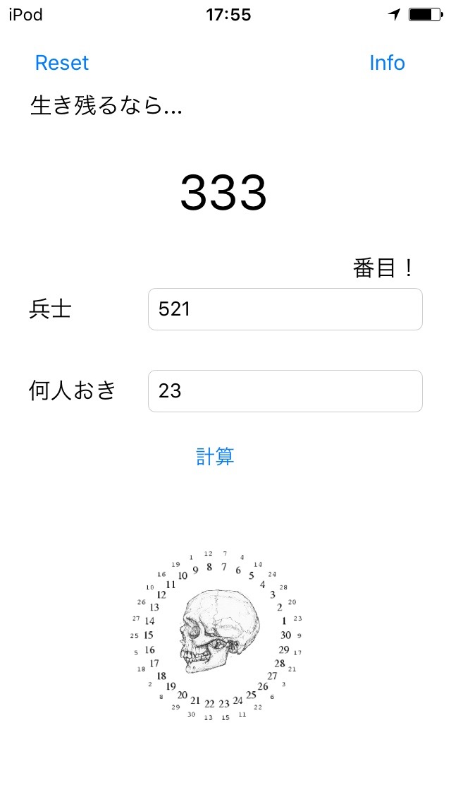
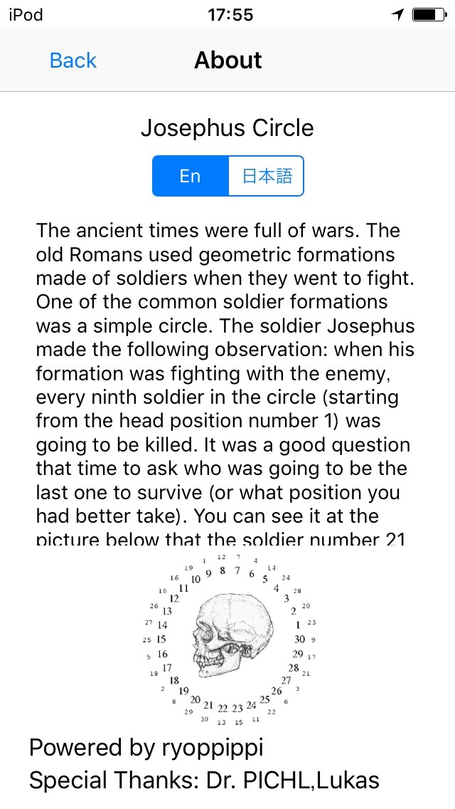

# Josephus-circle-iOS-app

Sample app for solving famous problem by swift2

Josephus circle is one of the most famous computer science problem.
I solved this problem in my programming class at my university. And I really love this problem so I made this app. It is my first time to code in swift2, and I realize how nice the swift language is!
This project taught me how to develop iOS apps and the basic of swift2.

##  Some infomation

* I don't know how the auto layout works so this app is only for devices with 4-inch display(iPhone 5,5S, iPod touch 6th gen)
* This app is made by swift2. You need iOS9 and Xcode7 to use this.

---

## ヨセフスの問題
Swift2で作ってみた有名な問題を解くアプリ

ヨセフスの問題はコンピューターサイエンスにおける最も有名な問題の一つです。
大学のプログラミングの授業中に解いた問題ですが、個人的にとても気に入った問題の一つだったので、iPod touchも買ったところだし作ってみようという思いつきから作ってしまいました。
初めてのGUIアプリケーションでもあり、Swiftを書くのも初めてだったので、アルゴリズムはほとんど変える必要がなかったにもかかわらず4時間ほどかかってしまいました。
このアプリ制作を通じて、どうiOSアプリを作っていくか、Swift2がどんなものなのかを学ぶことができました。またSwiftという言語そのものが気に入りました。

## 注意点

* オートレイアウトの設定の仕方がまだわからないため、このアプリは４インチディスプレイを持つiOSデバイス（iPhone 5, 5S, iPod touch 第６世代)のみに最適化されています。
* Swift2で書かれているため、実行するにはiOS9とXcode7が必要となります。

---
Powerd by @ryoppippi

Special Thanks: Dr. PICHL, Lukas
